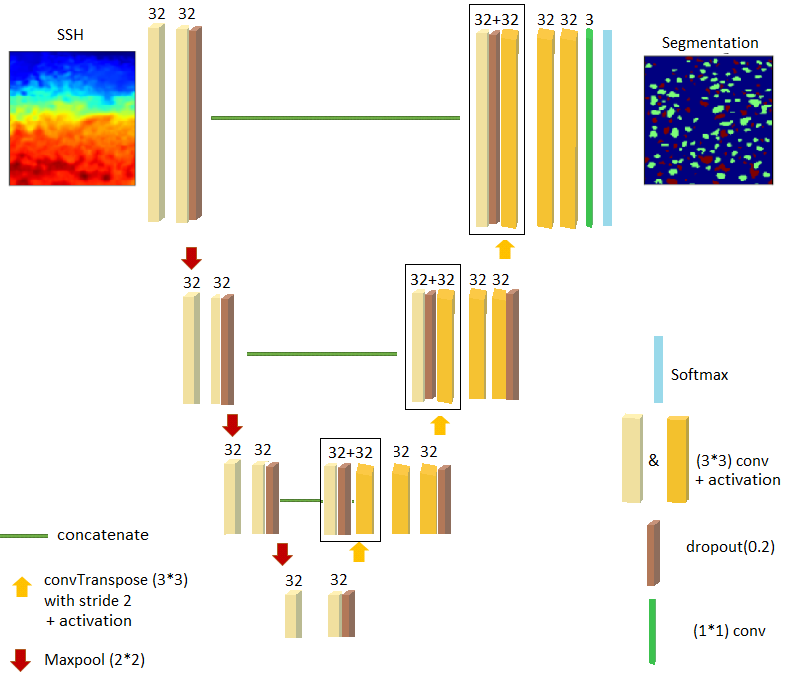
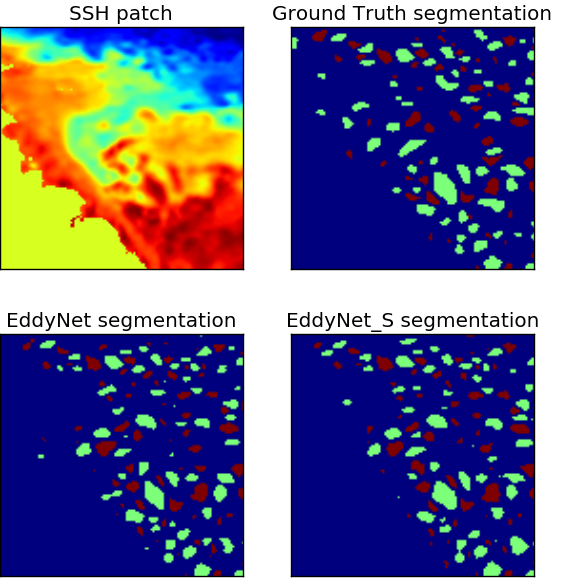
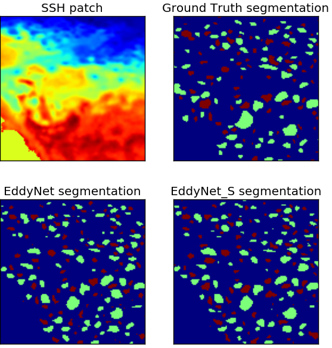
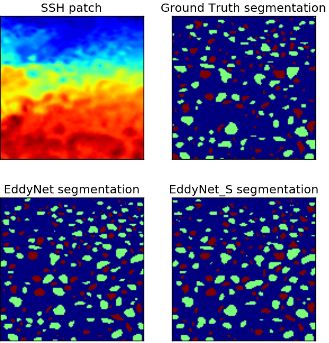

# Convolutional Neural Networks for the Segmentation of Oceanic Eddies from Altimetric Maps 
### (Technical report)

I am updating the repo with new code and results from "Convolutional Neural Networks for the Segmentation of Oceanic Eddies from Altimetric Maps". Preprint can be found [here](https://www.researchgate.net/publication/328837669_Convolutional_Neural_Networks_for_the_Segmentation_of_Oceanic_Eddies_from_Altimetric_Maps) 

I already made public some jupyter notebooks and data to let anyone start using it.

# EddyNet 
### (IGARSS conference paper)

EddyNet: A Deep Neural Network For Pixel-Wise Classification of Oceanic Eddies

This is the supplementary material of the publication "EddyNet: A Deep Neural Network For Pixel-Wise Classification of Oceanic Eddies", from R. Lguensat et al., accepted as an oral presentation for IGARSS2018. Pre-print at: https://arxiv.org/abs/1711.03954

Eddynet is an U-Net like architecture (a convolutional encoder-decoder followed by a pixel-wise classification layer + skip connections).  

### Paper main messages:
* A deep neural net that "emulates" the result of a geometry based and expert based method 
* Comparing EddyNet with a version where we use SELU activation function (EddyNet_S). Replacing directly ReLU+BN with SELU resulted in a noisy loss and hurted the performance, we then kept BN after maxpooling, transposed deconvolution and concatenation.
* For this multiclass classification problem, we use (1-mean dice coefficient) as a loss function instead of the categorical cross entropy loss
* Eddynet is easily modulable and can be used for further studies such as adding new information (e.g. Sea Surface Temperature), or training with another ground truth.

### Some examples of the segmentation

##### Note: Like all the Eddy detection algorithms (there is no consensus on the best method to use), the ground truth is not 100% perfect, very few eddies are missed. Still working on an improved dataset and I encourage other researchers to do so.
